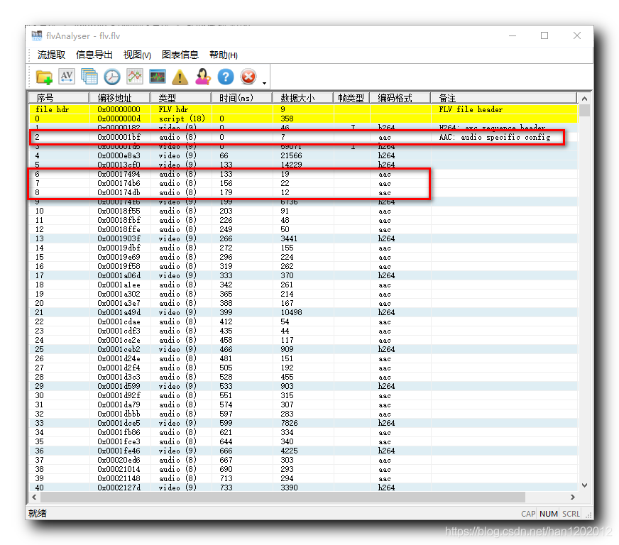
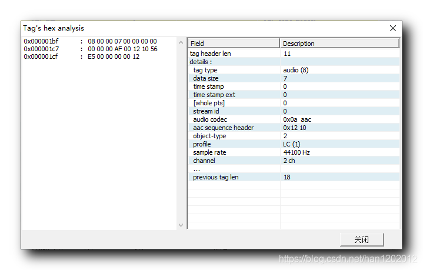
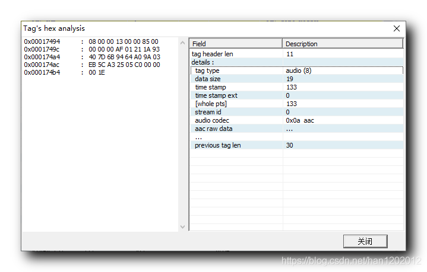

# 【Android RTMP】音频数据采集编码 ( AAC 音频格式解析 | FLV 音频数据标签解析 | AAC 音频数据标签头 | 音频解码配置信息 ) #

## 一、 AAC 音频格式解析 ##

**1 . AAC 音频文件格式 :**


① ADIF 格式 : 音频数据交换格式 ( Audio Data Interchange Format ) , 只有一份音频解码信息 , 存储在文件开头 , 这种格式适合存储音频文件 , 节省空间 , 但是必须从开始播放才可以 , 从中间位置无法播放 ;

② ADTS 格式 : 音频数据传输流格式 ( Audio Data Transport Stream ) , 每隔一段音频数据 , 就会有一份音频解码信息 , 这种格式适合音频流传输 , 可以在任何位置开始解码播放 ;


2 . 推流数据分析 : 当前的需求是需要将 FAAC 编码后的 AAC 数据推流到 RTMP 服务器中 , 推流时 , 需要推流的 AAC 格式不是上述两种格式 , 而是纯 AAC 裸数据 ;


3 . 音频帧数据必须完整 : 音频帧与视频帧存储机制不同 , 视频帧分为关键帧和非关键帧 , 音频采样都是关键帧 , 少一个采样都会有问题产生 , 如电流 , 卡顿等问题 ;


## 二、 FLV 音频数据标签解析 ##


**1. 分析 FLV 格式中的 AAC 音频格式数据**

分析 FLV 格式中的 AAC 音频格式数据 : 下图中的第 2 22 个音频数据标签 , 存储了音频特殊配置 , 之后的 AAC 音频数据标签都是普通的音频采样数据 ;


① 视频解码数据配置 : 视频的第一个视频标签数据是 H.264 , AVC 序列头数据 ( H.264 : AVC Sequence Header ) , 指导后续视频帧如何解码 ;

② 音频解码数据配置 : 音频的第一个音频标签数据是 AAC , 音频特殊配置数据 ( AAC : Audio Specific config ) , 指导后续音频采样如何解码 ;




**2. AAC 音频特殊配置**

打开第 2 22 个音频数据标签 : 内容如下 , 这是完整的音频标签数据 ;

```
0x000001bf	:   08 00 00 07 00 00 00 00 
0x000001c7	:   00 00 00 AF 00 12 10 56 
0x000001cf	:   E5 00 00 00 00 12
```



**3. AAC 音频数据标签**

AAC 音频数据标签 : 该标签中封装实际的音频采样 , AAC 格式的 ;

```
0x00017494	:   08 00 00 13 00 00 85 00 
0x0001749c	:   00 00 00 AF 01 21 1A 93 
0x000174a4	:   40 7D 6B 94 64 A0 9A 03 
0x000174ac	:   EB 5C A3 25 05 C0 00 00 
0x000174b4	:   00 1E
```



## 三、 FLV 音频数据标签头 ##

音频标签数据标签头解析 : 前 11 个字节时标签头信息 ; 这 11 1111 个字节仅做参考 , 在 RTMP 中是不封装这个标签头的 ;

```
0x000001bf	:   08 00 00 07 00 00 00 00 
0x000001c7	:   00 00 00
```

① 标签类型 ( tag type ) : 1 11 字节 , 索引区间 [ 0 ] [0][0] , 08 代表音频 , 09 代表视频 , 12 代表脚本信息 , 这里是 08 , 代表音频数据 ;

② 标签数据大小 ( data size ) : 3 33 字节 , 索引区间 [ 1 , 3 ] [1,3][1,3] , 除了包头之外的数据大小 , 包头一般是 11 1111 字节, 整个标签大小是该 标签数据大小 ( data size ) + 11 , 本标签的数据大小是 7 77 字节, 总的数据大小是 18 1818 字节, 十六进制对应 0x12 1212

③ 时间戳 ( time stamp ) : 3 33 字节 , 索引区间 [ 4 , 6 ] [4,6][4,6] , 表示从开始播放到当前时刻的播放时间 , 单位毫秒 , 也就是当前标签的时间与第一个标签时间的差值 ; 一般是 00 00 00 ;

④ 时间戳扩展位 ( time stamp ext ) : 1 11 字节 , 索引区间 [ 7 ] [7][7] , 如果时间戳较大 , 3 33 位装不下 , 扩展一位 ; 一般是 00 ;

⑤ 流编号 ( stream id ) : 3 33 字节 , 索引区间 [ 8 , 10 ] [8,10][8,10] , 一般都是 00 00 00 ;


组装 RTMP 包的时候 , 是不需要封装标签头的 , 直接将 AAC 裸数据 , 也就是这 7 77 个字节封装到 RTMP 包中 ;


## 四、 音频解码配置信息 ##


**1. AAC 音频数据**

AAC 音频数据 : 分为两类 , 解码配置数据, 音频采样数据 ;


① AAC 格式音频解码配置信息 : 下面的 7 77 个字节时音频解码配置信息 ;

```
0x000001bf	:   
0x000001c7	:            AF 00 12 10 56 
0x000001cf	:   E5
```

② AAC 音频数据标签数据采样信息 :

```
0x0001749c	:            AF 01 21 1A 93 
0x000174a4	:   40 7D 6B 94 64 A0 9A 03 
0x000174ac	:   EB 5C A3 25 05 C0
```


**2. 第 1 11 字节 AF 数据解析**

第 1 11 字节 AF 数据解析 : 前 4 44 位表示音频格式 , 之后的 2 22 位表示采样率 , 之后的 1 11 位表示采样长度 , 最后一位表示音频类型 ;


① 0xAF 使用二进制表示为 0b‭1010 1111‬ ;

② 音频格式 : 4 44 位 [ 7 : 4 ] : 0b1010 = 10 , 值为 10 , 表示 AAC 格式 ;

③ 采样率 : 2 22 位 [ 3 : 2 ] : 0b11 = 3 , 代表 44000 Hz 采样率 , AAC 格式一般都是 44000 采样率

|值	|采样率|
|0	|5500Hz|
|1	|11000Hz|
|2	|22000Hz|
|3	|44000Hz|

④ 采样位数 : 1 11 位 [ 1 ] : 0b1 = 1 , 代表采样长度 16 位 ;

|值	|采样位数|
|0	|8 位 / 1 字节|
|1	|16 位 / 2字节|

⑤ 音频通道 : 1 11 位 [ 0 ] : 0b1 = 1 , 代表立体声 ;

|值	|音频通道|
|0	|单声道|
|1	|立体声|

该位一般也就是声道不同 , 其它参数基本都是默认的值 , 立体声 AF , 单声道 AE ;


**3. 音频数据类型**

音频数据类型 :


① 音频解码配置信息 : 前两位是 AF 00 , 指导 AAC 数据如何解码 ;

② 音频采样信息 : 前两位是 AF 01 , 实际的 AAC 音频采样数据 ;

————————————————

版权声明：本文为CSDN博主「韩曙亮」的原创文章，遵循CC 4.0 BY-SA版权协议，转载请附上原文出处链接及本声明。

原文链接：https://blog.csdn.net/shulianghan/article/details/106802700/